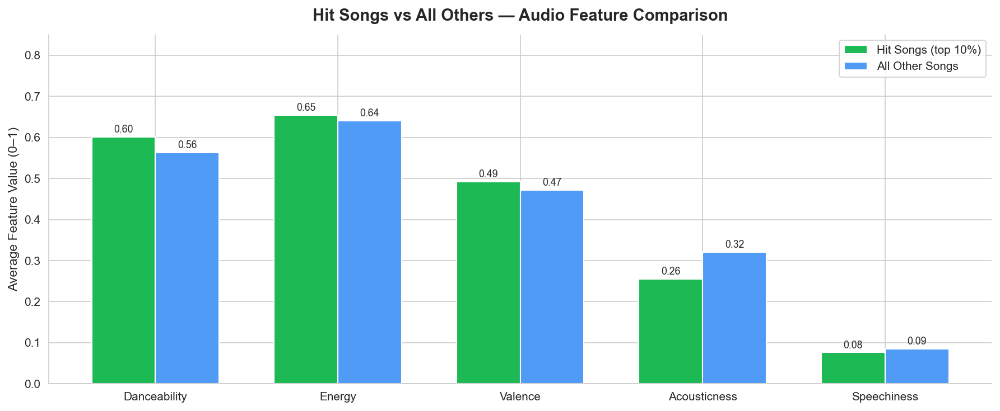
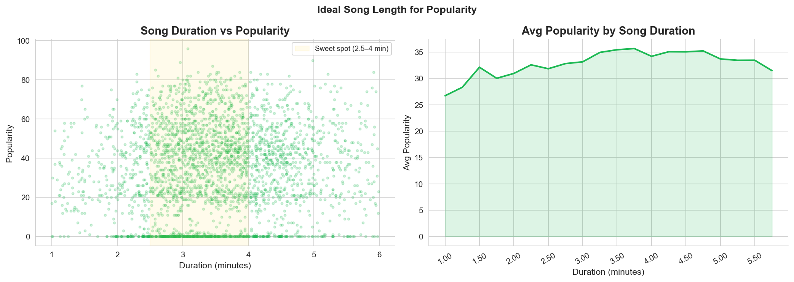
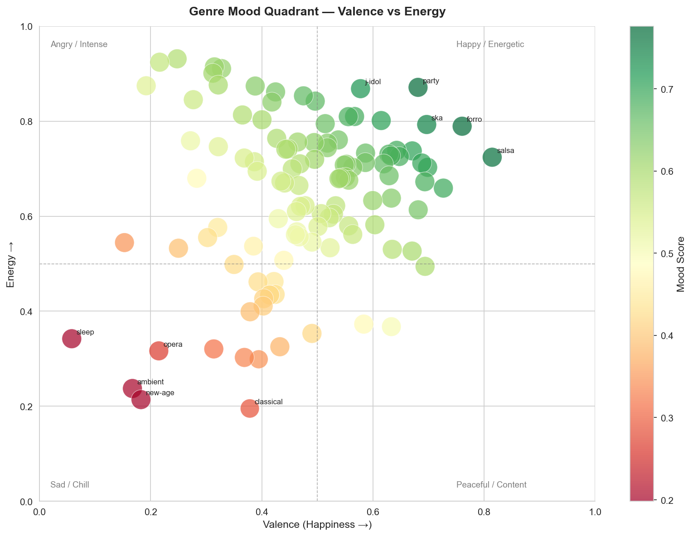
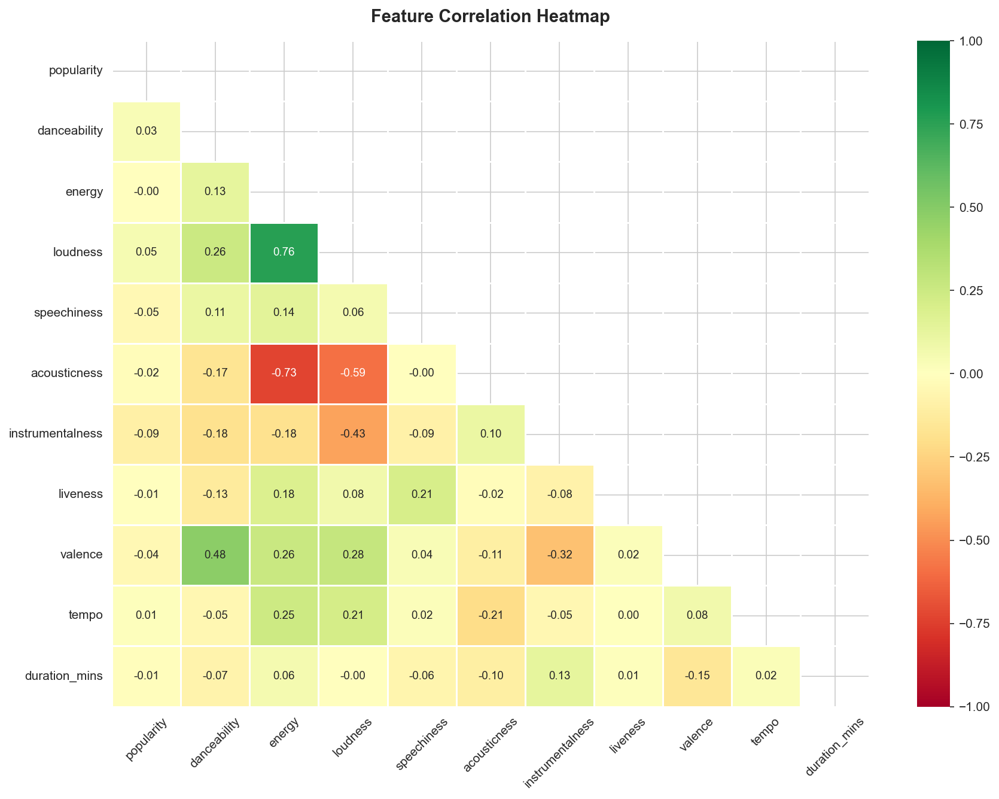

# 🎵 Spotify Data Analysis


> **Analyzing 600,000+ Spotify tracks to uncover what makes a song popular, how music has evolved across decades, and which audio features separate hit songs from everything else.**

---

## 📌 Questions This Project Answers

- What does the popularity distribution across 600K+ Spotify songs look like?
- Which audio features (danceability, energy, valence…) correlate most with popularity?
- What separates hit songs (top 10%) from all other tracks?
- How has music changed across decades — is modern music really louder and more energetic?
- Which genres and artists consistently dominate popularity charts?
- What is the 'ideal' song profile (length, mood, tempo) for maximum popularity?

---

## 📊 Key Findings

### Finding 1 — Hit songs share a consistent audio profile
Top 10% popularity tracks score significantly higher on **danceability** and **valence (happiness)**, while scoring lower on **acousticness** and **instrumentalness**. The hit formula is: vocal, upbeat, and danceable.



---

### Finding 2 — Music has gotten louder and more energetic every decade
Energy and loudness trended upward from the 1960s to the 2020s. Acousticness dropped sharply as electronic production took over. The 2010s saw a dip in valence — the "sad banger" era.


---

### Finding 3 — The sweet spot for song length is 2.5 – 4 minutes
Tracks in this range consistently outperform on popularity — the classic radio format that Spotify's algorithm appears to reward.



---

### Finding 4 — Genre mood landscape
Genres spread across four mood quadrants. Pop and Latin dominate the "Happy + Energetic" quadrant, while ambient and classical cluster in the "Peaceful + Low-energy" corner.



---

### Finding 5 — Correlation heatmap reveals no single feature predicts popularity
Popularity has weak individual correlations with all audio features — hit songs are multidimensional. The combination matters more than any one signal.



---

## 🗂 Project Structure

```
spotify-data-analysis/
├── spotify_analysis.ipynb    ← Full analysis notebook (10 sections)
├── requirements.txt          ← Python dependencies
├── images/                   ← All saved charts
│   ├── 01_popularity_distribution.png
│   ├── 02_correlation_heatmap.png
│   ├── 03_top_genres.png
│   ├── 04_top_artists.png
│   ├── 05_hit_vs_normal.png
│   ├── 06_song_duration.png
│   ├── 07_decade_trends.png
│   ├── 08_mood_by_genre.png
│   ├── 09_mood_quadrant.png
│   ├── plotly_genre_popularity.html  ← Interactive chart
│   └── plotly_energy_scatter.html    ← Interactive chart
├── data/
│   └── README.md             ← Dataset source info (CSV not uploaded)
└── README.md
```

---

## 📁 Dataset

**Source:** [Spotify Tracks Dataset — Kaggle](https://www.kaggle.com/datasets/maharshipandya/-spotify-tracks-dataset)

| Detail | Value |
|--------|-------|
| Rows | ~600,000 tracks |
| Features | 20+ audio features |
| Key columns | `popularity`, `danceability`, `energy`, `valence`, `tempo`, `loudness`, `acousticness`, `instrumentalness`, `speechiness`, `liveness`, `track_genre`, `artists`, `year` |

> Download the CSV from Kaggle and place it in the project root as `spotify-tracks-dataset.csv` before running the notebook.

---

## ⚙️ How to Run

### 1. Clone the repo
```bash
git clone https://github.com/vartikaseth/spotify-data-analysis.git
cd spotify-data-analysis
```

### 2. Install dependencies
```bash
pip install -r requirements.txt
```

### 3. Add the dataset
Download from Kaggle (link above) and place as:
```
spotify-tracks-dataset.csv
```

### 4. Launch the notebook
```bash
jupyter notebook spotify_analysis.ipynb
```

Run all cells in order. Charts are auto-saved to `images/`.

---

## 🛠 Tools & Libraries

| Tool | Purpose |
|------|---------|
| **Pandas** | Data loading, cleaning, feature engineering, groupby analysis |
| **NumPy** | Numerical operations, normalisation |
| **Matplotlib** | Static charts — histogram, scatter, bar, line |
| **Seaborn** | Styled statistical charts — heatmap, boxplot |
| **Plotly Express** | Interactive charts (genre popularity, energy scatter) |
| **Jupyter Notebook** | Narrative analysis environment |

---

## 📈 Analysis Sections

| Section | What it covers |
|---------|---------------|
| 1. Setup & Imports | Libraries, global style config, images folder setup |
| 2. Load Dataset | Load CSV, inspect shape and columns |
| 3. Data Cleaning | Drop nulls, remove duplicates, validate types |
| 4. Feature Engineering | Duration (mins), energy/tempo buckets, decade, mood score, collab flag |
| 5. EDA | Popularity distribution, correlation heatmap, top genres, top artists (fixed), top tracks |
| 6. Hit Song Analysis | Top 10% vs rest comparison, ideal song length |
| 7. Decade Trends | How energy, valence, danceability, acousticness shifted over 60 years |
| 8. Mood Analysis | Happiest/darkest genres, mood quadrant scatter |
| 9. Plotly Interactive | Genre popularity bar, energy vs popularity scatter |
| 10. Key Findings | Narrative summary of all insights |

---

## 👩‍💻 Author

**Vartika Seth**  
B.Sc. Mathematics · M.Sc. Data Science (In Progress)  
📧 sethvartika19@gmail.com  
🔗 [LinkedIn](https://www.linkedin.com/in/vartika-seth-228183315) · [GitHub](https://github.com/vartikaseth)

---

*Part of my data analyst portfolio. See also: [Retail Sales Analysis (Power BI)](../retail-sales-powerbi) · [Customer Segmentation (SQL)](../customer-sql-analysis)*
